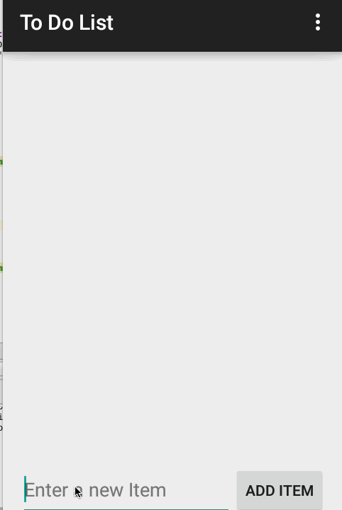

# Todo List Pre-work

This is an Android application to track todo list items.

Time spent: 6 hours in total.

Completed user stories:
[X] Required: User can add items to the list
[X] Required: User can edit items
[X] Required: User can remove items
[X] Optional: Items persisted in SQLite
[X] Optional: Items can be given due dates
[X] Optional: Items can be marked complete without being removed

Walkthrough of the app:

